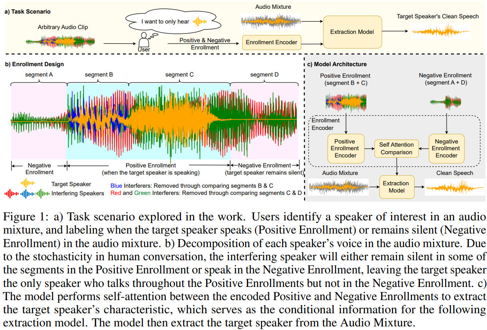
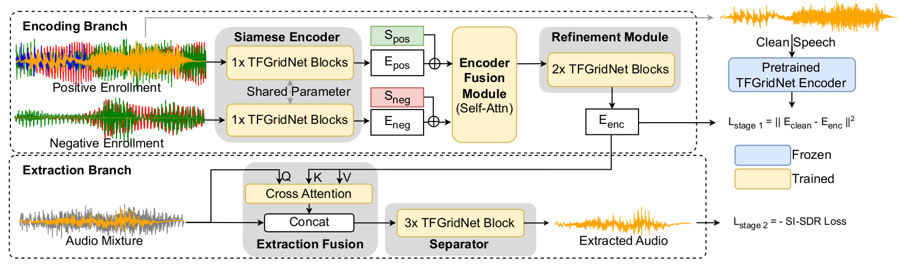

# TSE through comparing Positive and Negative Enrollments
This repository provide the training and testing code for the paper: "Target Speaker Extraction through Comparing Noisy Positive and Negative Audio Enrollments" (Accepted by [NeurIPS 2025](https://neurips.cc/virtual/2025/poster/117224))

In this work, we explore a novel enrollment strategy that encodes target speaker information from the noisy enrollment by comparing segments where the target speaker is talking (Positive Enrollments) with segments where the target speaker is silent (Negative Enrollments).

Thanks for the suggestions given by the reviewers, in addition to the model described in the paper, we trained a model variant using the fusion method proposed in USEF-TFGridnet. Please see the details in section [Improve Model Performance with Early Fusion](#improve-model-performance-with-early-fusion).

<p align="center">
  
</p>

# Prepare datasets

1. download the [LibriSpeech dataset](https://www.openslr.org/12) `train-360`, `dev-clean`, `test-clean` splits under `data/LibriSpeech` repository, and provide their names in the `{train/val}_dataset_dir` variable in the yaml config file.

2. download the [WHAM! noise dataset](http://wham.whisper.ai/) under `data/wham_noise` repository, and provide its path in the *noise_dir* variable in the yaml config file.

3. (optional) download BRIR datasets for binaural model training and testing. We used the same BRIR datasets as the LookOnceToHear, which provide the self-contained datasets in [here](https://drive.google.com/drive/u/1/folders/1-Jx23GXdjPe33EF5jGZpj6zn-kIm5jHR). Download and unzip these datasets in the `data` repository and provide their name in the *brir_dir* variable in the yaml config file.

# Training 

Our first stage training performs knowledge distillation on a trained TFGridnet encoder. We used the trained encoder from [here](https://drive.google.com/file/d/1CP0zbZExcqvNLdP9epyhY4fEVp_oQr59/view) under the `runs/embed/best.ckpt`. Download the checkpoint and move under the `model` directory.

The first and the second stage training share the same training python code, but with different hyperparameters (i.e. yaml config file) provided. For example, to train the monaural model:

```python
# first stage training
python train.py configs/Hyperparameter_monaural_stage-1.yaml

# second stage training
python train.py configs/Hyperparameter_monaural_stage-2.yaml
```

To train the binaural model, use the `Hyperparameter_binaural_stage-{1/2}.yaml` files.

After training, the checkpoints and the losses are saved in the `output` directory

# Checkpoints and Evaluation

To perform evaluation, specify the evaluated model's checkpoint path in the `eval_{monaural/binaural}.py` file `model` section, change the hyperparameters in the `hyperparams` section, and run `python eval_{monaural/binaural}.py` to perform evaluation. We provide model checkpoints in [Huggingface](https://huggingface.co/ShitongXu/TSE-Pos-Neg-Enroll/tree/main). 


# Examples
We provide 4 audio examples of our model in `example` folder. 

In each folder, we include the following 5 audios:
- `*-mix.wav` is the Mixed Audio input to our model. Our model aims at extracting the target speaker from this audio Mixture. 
- `*-{pos/neg}.wav` is the Positive or Negative Enrollment used by our model to learn the target speaker's voice characteristics.
- `*-tgt.wav` is the ground truth target speaker's voice in the Mixed Audio.
- `*-out.wav` is the target speaker's voice in the Mixed Ausdio extracted by our model. 

# Improve Model performance with Early Fusion

Following the reviewers' suggestions, we implemented the early fusion method proposed in USEF-TFGridnet. Figure below shows the model variant's architecture:

<p align="center">
  
</p>


The model variant is also trained with a two-staged training method:

```python
# first stage training
python train-improved-model.py configs/Hyperparameter_monaural_improved_stage-1.yaml

# second stage training
python train-improved-model.py configs/Hyperparameter_monaural_improved_stage-2.yaml
```

The evaluation code remains the same as above. Checkpoint of the model variant can be found in [Huggingface](https://huggingface.co/ShitongXu/TSE-Pos-Neg-Enroll/blob/main/improved-monaural.pt). The improved model performance is shown below:

| Metric       | 2 Spk. in Mixture (2 Spk. in Enroll) | 2 Spk. in Mixture (3 Spk. in Enroll) | 3 Spk. in Mixture (2 Spk. in Enroll) | 3 Spk. in Mixture (3 Spk. in Enroll) | 
|--------------|--------------------------|--------------------------|--------------------------|--------------------------|
| **SNRi**  | 12.34 $\pm$ 3.77 | 12.13 $\pm$ 4.06 | 12.32 $\pm$ 3.59 | 12.19 $\pm$ 3.79 |
| **SI-SNRi** | 11.76 $\pm$ 5.56 | 11.40 $\pm$ 6.17 | 11.22 $\pm$ 5.77 | 10.91 $\pm$ 6.40 |
| **SISDRi** | 12.51 $\pm$ 5.04 | 12.16 $\pm$ 5.67 | 11.88 $\pm$ 5.35 | 11.62 $\pm$ 5.86 |
| **PESQ**     | 2.61 $\pm$ 0.42 | 2.58 $\pm$ 0.46 | 2.30 $\pm$ 0.49 | 2.27 $\pm$ 0.51 |
| **STOI**     | 0.83 $\pm$ 0.15 | 0.83 $\pm$ 0.16 | 0.74 $\pm$ 0.19 | 0.73 $\pm$ 0.19 |
| **DNSMOS**   | 2.80 $\pm$ 0.33 | 2.79 $\pm$ 0.35 | 2.64 $\pm$ 0.35 | 2.62 $\pm$ 0.36 |
| **WER**      | 0.24 $\pm$ 0.26 | 0.25 $\pm$ 0.28 | 0.38 $\pm$ 0.30 | 0.40 $\pm$ 0.30 |

# Citation
```
@misc{xu2025comparingtse,
      title={Target Speaker Extraction through Comparing Noisy Positive and Negative Audio Enrollments}, 
      author={Shitong Xu and Yiyuan Yang and Niki Trigoni and Andrew Markham},
      year={2025},
      eprint={2502.16611},
      archivePrefix={arXiv},
      primaryClass={cs.SD},
      url={https://arxiv.org/abs/2502.16611}, 
}
```
